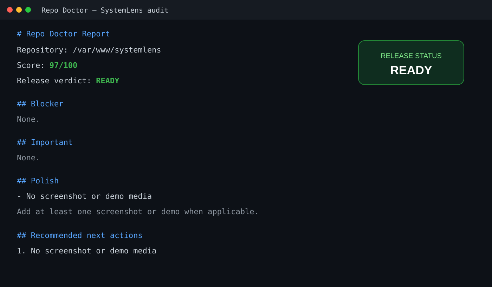

# 🩺 Repo Doctor

**Audit a Git repository before you make it public.**

Repo Doctor checks a repository for security mistakes, missing documentation, installation friction, and weak portfolio presentation — then produces a prioritized release-readiness report.

Built for people using AI coding agents who want to publish projects without accidentally exposing secrets or shipping a confusing GitHub repository.

## See it in action

Repo Doctor audited [SystemLens](https://github.com/JinjiLI-0725/systemlens) after it was prepared for public release.

<p align="center">
  
</p>

### Example output

```text
# Repo Doctor Report

Repository: /var/www/systemlens
Score: 97/100
Release verdict: READY

Blocker
None.

Important
None.

Polish
- No screenshot or demo media

Recommended next actions
1. No screenshot or demo media
```

This is the kind of result Repo Doctor is designed for: **clear enough to act on immediately, without exposing secret values.**

## What it checks

### 🔐 Security
- tracked `.env` files
- possible API keys
- private keys
- secret-like files
- `.gitignore` coverage

### 🧹 Repository hygiene
- clean working tree
- Git remote
- dependency lockfiles
- tests
- configuration hygiene

### 📖 Documentation
- README quality
- setup instructions
- tech stack
- environment configuration

### 💼 Portfolio readiness
- clear value proposition
- live demo links
- screenshots
- recruiter-readable presentation

## Quick start

```bash
python3 scripts/audit_repo.py /path/to/repository
```

Example:

```bash
python3 scripts/audit_repo.py /var/www/systemlens
```

## Use as an Agent Skill

Give this repository to Claude Code, Codex, or another coding agent and say:

> Use Repo Doctor to audit this repository before I make it public.

The agent should start from [`SKILL.md`](SKILL.md).

## Output

Repo Doctor produces:

- a score out of 100
- a release verdict
- blockers
- important fixes
- portfolio polish
- prioritized next actions

## Philosophy

A public repository should be:

**safe → understandable → runnable → worth exploring**

## License

MIT
